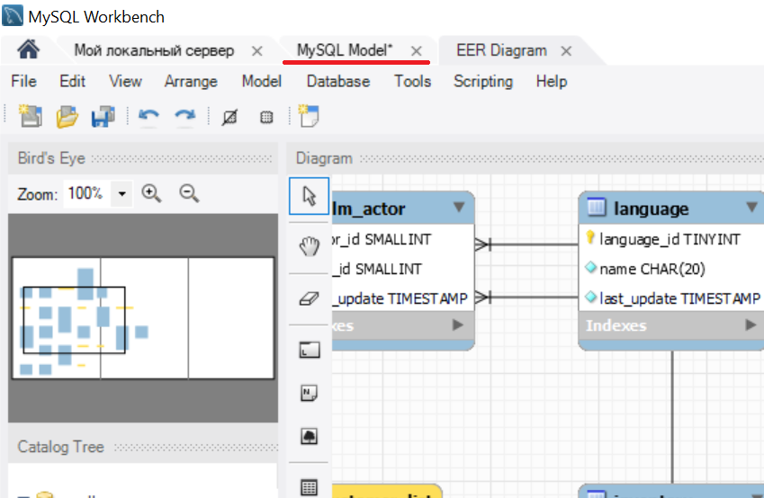

# Базы данных 2. Проектирование баз данных

## Создание ER-диаграмм в MySQL Workbench

1. Откройте MySQL Workbench и подключитесь к серверу.
2. Выберите в главном меню "Database", "Reverse Engineering...".
3. В открывшемся мастере:
   * В разделе "Connection Options" выберите подключение в параметре "Stored Connection".
   * В разделе "Select Schemas" выберите `sakila`.
   * Остальные параметры оставьте без изменений.
4. Изучите получившуюся диаграмму.
5. Сделайте скриншот диаграммы и сохраните его в каталоге репозитория.
6. Откройте вкладку с моделью базы данных MySQL. Обратите внимание, что диаграмма является её частью.

   

7. Сохраните модель в файл в каталоге репозитория (используйте пункт в главном меню File, Save).

## Приведите таблицы в нормальную форму

1. Откройте таблицу `tables1.xlsx` в Excel и приведите данные на обоих листах к первой нормальной форме. При выполнении этого задания не добавляйте и не изменяйте названия листов.
2. Откройте таблицу `tables2.xlsx` в Excel и приведите данные ко второй нормальной форме. При выполнении этого задания вам нужно будет добавить лист `departments` для отделов и `positions` для должностей.
3. Откройте таблицу `tables3.xlsx` в Excel и приведите данные на обоих листах к третей нормальной форме.
